<p align="center">
  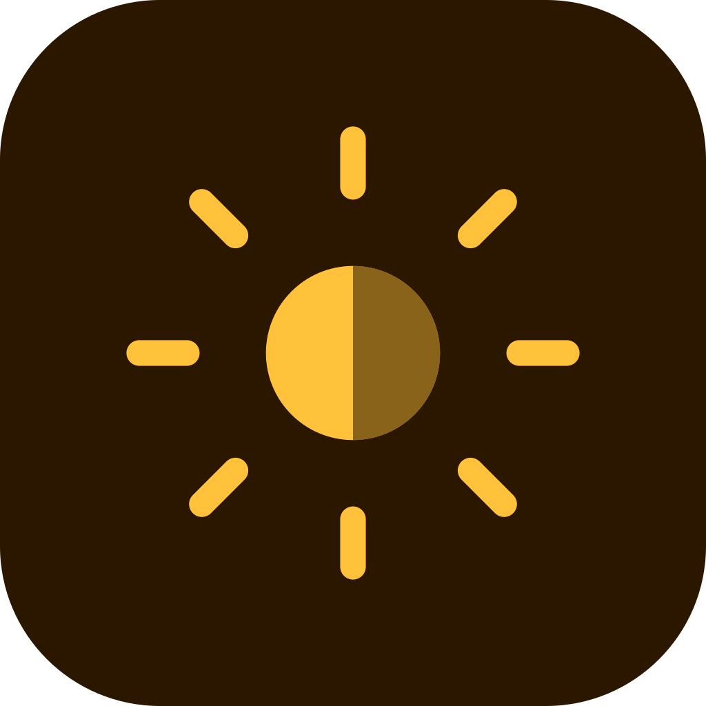
</p>

<h1 align="center">Sombra</h1>

<p align="center">
  An Android app that helps you stay safe in the sun.<br />
  Real-time UV index · personalised safe exposure time · sunscreen reminders · home screen widget
</p>

<p align="center">
  
  
  
  
  
</p>

<p align="center">
  <a href="#why">Why</a> ·
  <a href="#screenshots">Screenshots</a> ·
  <a href="#features">Features</a> ·
  <a href="#architecture">Architecture</a> ·
  <a href="#getting-started">Getting started</a> ·
  <a href="#roadmap">Roadmap</a>
</p>

---

## Why

Most people check the temperature before going out, but temperature isn't what burns you. **UV radiation is.** A cool, cloudy day can still have a UV index of 6 or 7, because clouds let most UV through.

Sombra puts the **UV index first**. It tells you how long you can stay outside before your skin starts to burn, based on your skin type, and reminds you when it's time to reapply sunscreen.

## Screenshots

<table align="center">
  <tr>
    <td align="center">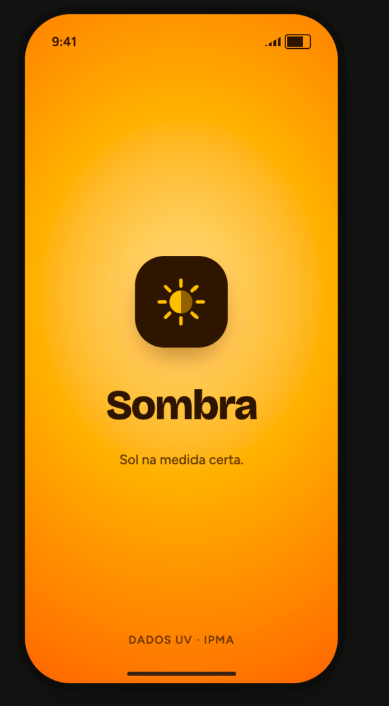</td>
    <td align="center">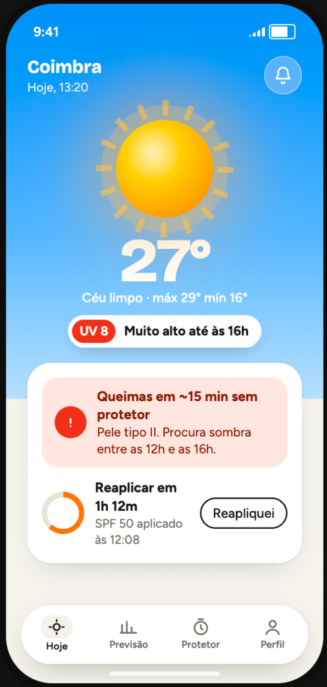</td>
    <td align="center">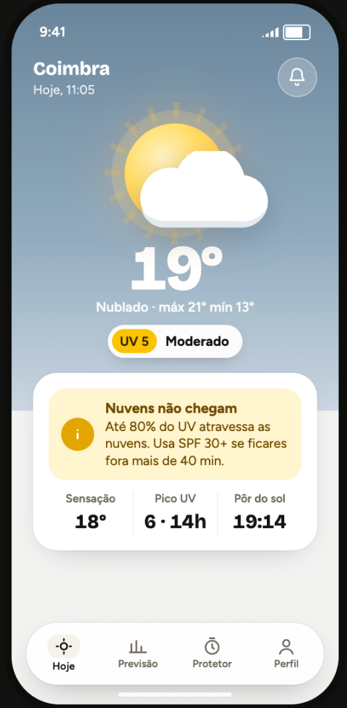</td>
  </tr>
  <tr>
    <td align="center"><b>Splash</b></td>
    <td align="center"><b>Home · sunny</b></td>
    <td align="center"><b>Home · cloudy</b></td>
  </tr>
  <tr>
    <td align="center">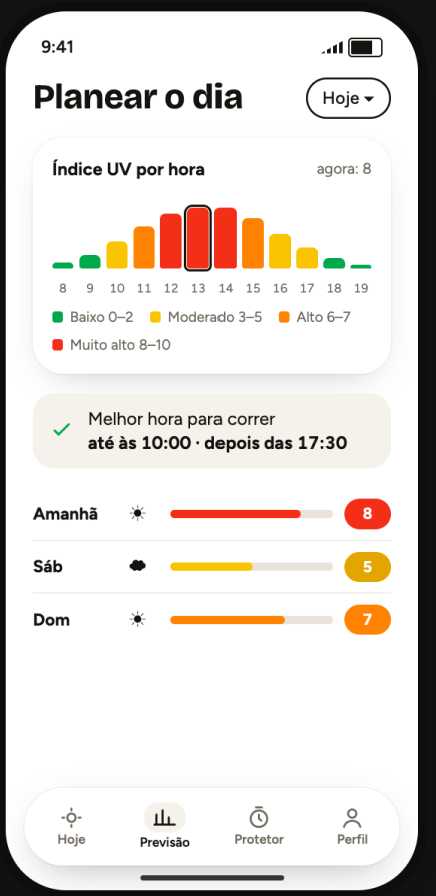</td>
    <td align="center">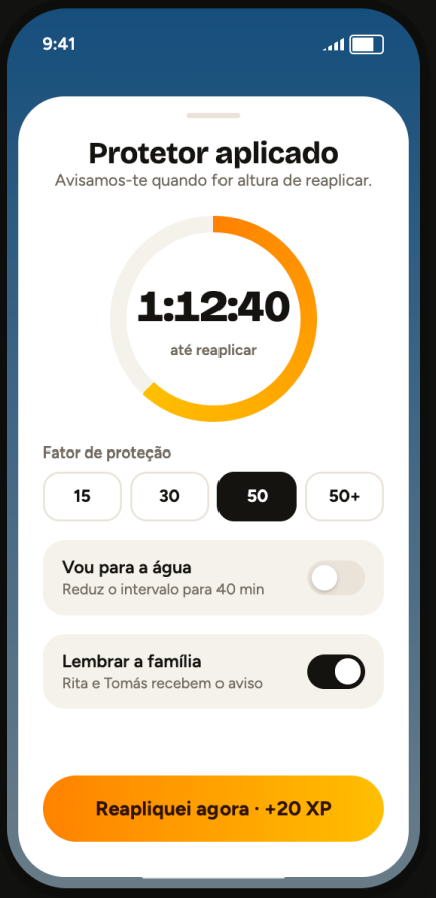</td>
    <td align="center">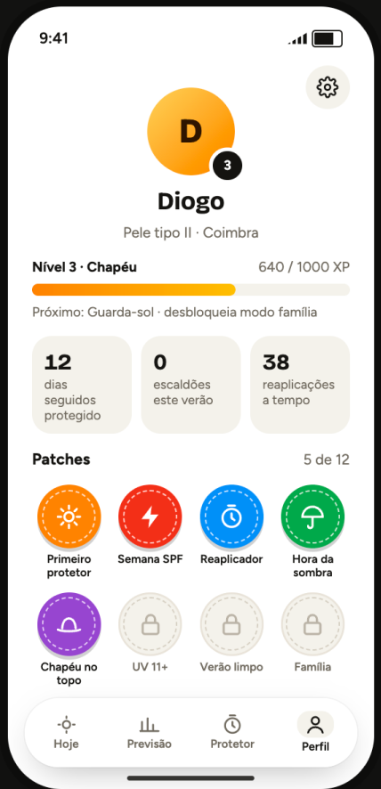</td>
  </tr>
  <tr>
    <td align="center"><b>UV forecast</b></td>
    <td align="center"><b>Sunscreen timer</b></td>
    <td align="center"><b>Profile</b></td>
  </tr>
</table>

> [!NOTE]
> These are design mockups. They will be replaced with real screenshots as each screen is implemented.

## Features

| | Feature | Description |
|:---:|---|---|
| ☀️ | **Real-time UV index** | For your current location, colour-coded with the WHO UV scale |
| ⏱️ | **Safe exposure time** | "You'll burn in ~20 min without sunscreen", based on your skin type (Fitzpatrick I–VI) and the current UV |
| 🧴 | **SPF recommendation** | Adapts to the UV level and your skin |
| 🔔 | **Sunscreen reminders** | Reapply every 2 hours, or every 40 minutes after swimming |
| ⚠️ | **Daily UV alerts** | "UV will be high today at 1 PM" |
| 📅 | **Forecast** | Hourly forecast with safe time windows (UV below 3) and a 5-day outlook |
| 📱 | **Home screen widget** | Current UV and time until the next reapplication |
| 📴 | **Works offline** | The last forecast is cached and shown with its update time |
| 🏅 | **Levels and patches** | Rewards protective habits (reapplying on time, avoiding peak hours), never time spent in the sun |
| 🌗 | **Themes and languages** | Light and dark theme, English and Portuguese |

### Levels

Users level up by building protective habits.

<table align="center">
  <tr>
    <td align="center"></td>
    <td align="center"></td>
    <td align="center"></td>
    <td align="center"></td>
    <td align="center">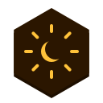</td>
  </tr>
  <tr>
    <td align="center">1 · Sombrinha</td>
    <td align="center">2 · Filtro</td>
    <td align="center">3 · Chapéu</td>
    <td align="center">4 · Guarda-sol</td>
    <td align="center">5 · Eclipse</td>
  </tr>
</table>

### Patches

<table align="center">
  <tr>
    <td align="center"></td>
    <td align="center"></td>
    <td align="center"></td>
    <td align="center"></td>
  </tr>
  <tr>
    <td align="center">Primeiro Protetor</td>
    <td align="center">Semana SPF</td>
    <td align="center">Reaplicador</td>
    <td align="center">Hora da Sombra</td>
  </tr>
  <tr>
    <td align="center"></td>
    <td align="center"></td>
    <td align="center"></td>
    <td align="center"></td>
  </tr>
  <tr>
    <td align="center">Chapéu no Topo</td>
    <td align="center">UV Extremo</td>
    <td align="center">Verão Limpo</td>
    <td align="center">Família</td>
  </tr>
</table>

## Tech stack

| Area | Technology | Status |
|---|---|:---:|
| Language | Kotlin 2.2, Coroutines, Flow | ✅ |
| UI | Jetpack Compose, Material 3 | ✅ |
| Navigation | Navigation Compose (type-safe routes) | ✅ |
| Splash | SplashScreen API with an animated exit | ✅ |
| Dependency injection | Hilt (KSP) | ✅ |
| Architecture | MVVM + Clean Architecture, multi-module, unidirectional data flow | ✅ |
| Networking | Ktor client + kotlinx.serialization | 🔜 |
| Weather data | [Open-Meteo Forecast API](https://open-meteo.com/) (no API key needed) | 🔜 |
| Authentication | [Supabase Auth](https://supabase.com/docs/guides/auth) via `supabase-kt` | 🔜 |
| Local database | Room (forecast cache, sunscreen log, exposure history) | 🔜 |
| Preferences | DataStore (skin type, settings) | 🔜 |
| Location | Fused Location Provider (coarse location only) | 🔜 |
| Background work | WorkManager | 🔜 |
| Widget | Jetpack Glance | 🔜 |
| Testing | JUnit, MockK, Turbine, Compose UI tests | 🔜 |
| CI | GitHub Actions (build, lint, unit tests) | 🔜 |

✅ in place · 🔜 planned

## Architecture

The project is split into Gradle modules. Dependencies only point one way, so the business rules in `domain` never depend on Android or on the UI.

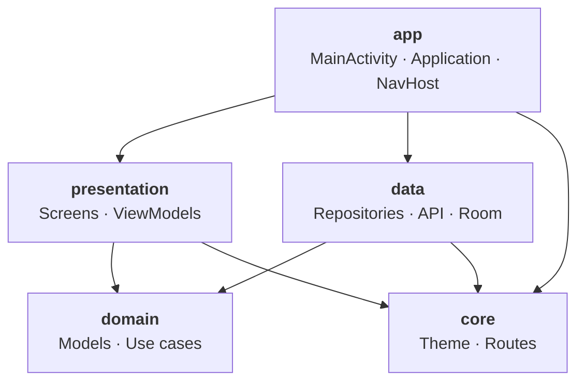

| Module | Responsibility |
|---|---|
| `app` | Entry point: `MainActivity`, `SombraApplication` (`@HiltAndroidApp`), splash screen and the `SombraNavHost` |
| `presentation` | One package per screen with `Screen`, `ViewModel`, `UiState` and its navigation entry |
| `domain` | Models and use cases in pure Kotlin. Depends on no other module |
| `data` | Repository implementations, Open-Meteo client, Room, DataStore, Supabase |
| `core` | Design system (`SombraTheme`, `SombraColors`) and the navigation routes |

### Data flow

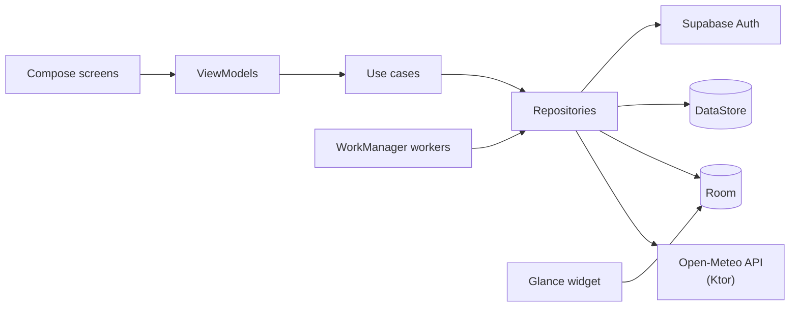

The app is **offline-first**: screens always read from Room. Repositories refresh the cache from the network in the background and expose the result as a `Flow`. The widget reads only from Room and never makes network calls.

## Project structure

```
Sombra/
├── Assets/                         # Logo, mockups, illustrations (SVG, PNG, Android drawables)
├── README.md
└── Sombra/                         # Android Studio project
    ├── app/
    │   └── com/dmm/sombra/
    │       ├── MainActivity.kt         # Splash screen + setContent
    │       ├── SombraApplication.kt    # @HiltAndroidApp
    │       └── navigation/
    │           └── SombraNavHost.kt    # Every screen of the app
    ├── presentation/
    │   └── com/dmm/presentation/
    │       ├── main/                   # MainViewModel (session check behind the splash)
    │       └── home/
    │           ├── HomeScreen.kt       # HomeScreen (stateful) + HomeContent (stateless)
    │           ├── HomeViewModel.kt
    │           ├── HomeUiState.kt
    │           └── HomeNavigation.kt   # NavGraphBuilder.homeScreen()
    ├── domain/                         # Models, use cases, repository interfaces
    ├── data/                           # Repository implementations, API, database
    ├── core/
    │   └── com/dmm/core/
    │       ├── designsystem/           # SombraTheme, SombraColors, Type, Shape
    │       └── navigation/             # SombraRoutes (@Serializable routes)
    └── gradle/
        └── libs.versions.toml          # All dependency versions
```

### Adding a new screen

1. Add a route in `core/navigation/SombraRoutes.kt`:

   ```kotlin
   @Serializable
   data object SkinTypeRoute
   ```

2. Create a package in `presentation/` with `SkinTypeScreen.kt`, `SkinTypeViewModel.kt`, `SkinTypeUiState.kt` and `SkinTypeNavigation.kt`, using `home/` as a template.
3. Register it in `SombraNavHost.kt` with `skinTypeScreen(...)`, and open it with `navController.navigate(SkinTypeRoute)`.

## Getting started

### Requirements

- Android Studio (latest stable)
- JDK 17
- An Android device or emulator running **Android 7.0 (API 24)** or later
- A free [Supabase](https://supabase.com/) project (only needed once login is implemented)

### 1. Clone the repository

```bash
git clone https://github.com/DMarques24/Sombra.git
cd Sombra/Sombra
```

### 2. Set up Supabase

1. Create a project at [supabase.com](https://supabase.com/).
2. Under **Authentication → Providers**, enable **Email**.
3. Under **Project Settings → API**, copy the **Project URL** and the **anon public key**.
4. Add them to `local.properties` in the Android project folder. This file is git-ignored, so keys are never committed:

   ```properties
   SUPABASE_URL=https://your-project-id.supabase.co
   SUPABASE_ANON_KEY=your-anon-key
   ```

   They are exposed to the app through `BuildConfig`.

### 3. Run

Open the `Sombra/` folder in Android Studio, wait for Gradle to sync, and run the `app` configuration.

From the command line:

```bash
./gradlew installDebug        # build and install on a connected device
./gradlew testDebugUnitTest   # unit tests
./gradlew connectedCheck      # UI tests (device or emulator needed)
./gradlew lint                # static analysis
```

Open-Meteo doesn't need an API key, so weather data works straight away.

## How it works

### UV data

The app calls the Open-Meteo forecast endpoint with the device's coarse location:

```http
GET https://api.open-meteo.com/v1/forecast
    ?latitude=40.21&longitude=-8.43
    &current=uv_index,temperature_2m,weather_code,is_day
    &hourly=uv_index,temperature_2m
    &daily=uv_index_max,sunset
    &timezone=auto
```

The `weather_code` returned by the API picks the illustration shown on the Home screen:

<table align="center">
  <tr>
    <td align="center"></td>
    <td align="center"></td>
    <td align="center"></td>
    <td align="center">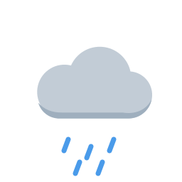</td>
    <td align="center"></td>
  </tr>
  <tr>
    <td align="center">Clear<br /><code>0, 1</code></td>
    <td align="center">Partly cloudy<br /><code>2</code></td>
    <td align="center">Cloudy<br /><code>3, 45, 48</code></td>
    <td align="center">Rain<br /><code>51–67, 80–82, 95+</code></td>
    <td align="center">Night<br /><code>is_day = 0</code></td>
  </tr>
</table>

### UV scale (WHO)

| UV index | Level | Colour |
|:---:|---|---|
| 0–2 | Low | 🟢 Green |
| 3–5 | Moderate | 🟡 Yellow |
| 6–7 | High | 🟠 Orange |
| 8–10 | Very high | 🔴 Red |
| 11+ | Extreme | 🟣 Violet |

### Safe exposure time

Each Fitzpatrick skin type has a minimal erythemal dose (MED), the amount of UV energy that causes visible reddening. One UV index unit is 0.025 W/m² of erythemal irradiance, so:

```
minutes to burn ≈ MED (J/m²) / (UV index × 0.025 × 60)
```

For example, skin type II (MED ≈ 250 J/m²) at UV 8 gives about 20 minutes.

> [!IMPORTANT]
> The result is **not** multiplied by the SPF value. In real life people apply much less sunscreen than the amount used in lab tests, so the app caps the estimate and always shows it as a guideline.

### Background work

| Worker | Type | What it does |
|---|---|---|
| `ForecastSyncWorker` | Periodic (every 3 h) | Refreshes the cache, updates the widget, schedules today's UV alert |
| `UvAlertWorker` | One-time | Notifies before the UV index reaches 6 or more |
| `ReapplyReminderWorker` | One-time (2 h or 40 min delay) | Reminds you to reapply sunscreen |

WorkManager doesn't fire at the exact minute. A few minutes of delay is fine for a sunscreen reminder, and it avoids the exact-alarm permission that Android 14 restricts.

## Permissions

| Permission | Why |
|---|---|
| `ACCESS_COARSE_LOCATION` | UV index for your area. City-level precision is enough, so precise location is never requested. |
| `POST_NOTIFICATIONS` | UV alerts and sunscreen reminders. Requested only when you turn on your first reminder (Android 13+). |
| `INTERNET` | Forecast data and sign-in. |

If you deny location access, you can choose a city manually.

## Privacy

- Your **account** (email and password) is managed by Supabase Auth.
- Your **skin type, sunscreen log and exposure history stay on your device**. They are never sent to a server.
- Your location is used only to request the forecast and is not stored.

## Roadmap

- [x] Multi-module project setup (`app`, `presentation`, `domain`, `data`, `core`)
- [x] Design system: colours, light and dark theme
- [x] Splash screen with animated logo
- [x] Hilt dependency injection
- [x] Type-safe navigation
- [ ] CI with GitHub Actions
- [ ] Open-Meteo integration
- [ ] Room cache and offline mode
- [ ] Location with permission handling
- [ ] Home screen (sunny / cloudy states)
- [ ] Hourly and 5-day UV forecast
- [ ] Supabase login and register
- [ ] Skin type onboarding and safe exposure calculation
- [ ] UV alerts and sunscreen reminders (WorkManager)
- [ ] Glance widget
- [ ] Levels and patches
- [ ] Accessibility, EN/PT translations
- [ ] Release build on GitHub Releases

## Disclaimer

> [!WARNING]
> Sombra gives general guidance based on public weather data. It is not medical advice. If you have concerns about your skin, talk to a dermatologist.

## Author

**Diogo Marques** · [github.com/DMarques24](https://github.com/DMarques24)

## License

Copyright © 2026 Diogo Marques. All rights reserved.

The source code is public so it can be viewed and reviewed. You may not copy, modify or distribute it without permission.
