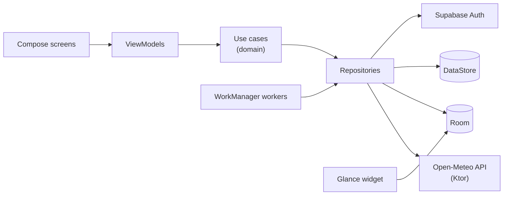

<p align="center">
  
</p>

<h1 align="center">Sombra</h1>

<p align="center">
  An Android app that helps you stay safe in the sun.<br/>
  Real-time UV index · personalised safe exposure time · sunscreen reminders · home screen widget
</p>

<p align="center">
  
  
  
  
</p>

---

## Why

Most people check the temperature before going out, but temperature isn't what burns you. UV radiation is. A cool, cloudy day can still have a UV index of 6 or 7, because clouds let most UV through.

Sombra puts the **UV index first**. It tells you how long you can stay outside before your skin starts to burn, based on your skin type, and reminds you when it's time to reapply sunscreen.

## Screenshots

| Splash | Home · sunny | Home · cloudy | UV forecast | Sunscreen timer | Profile |
|:---:|:---:|:---:|:---:|:---:|:---:|
|  |  |  |  |  |  |

> Screenshots will be updated as features are implemented.

## Features

- **Real-time UV index** for your current location, colour-coded with the WHO UV scale
- **Safe exposure time**: "you'll burn in ~20 min without sunscreen", based on your skin type (Fitzpatrick I–VI) and the current UV
- **SPF recommendation** that adapts to the UV level and your skin
- **Sunscreen reminders**: reapply every 2 hours, or every 40 minutes after swimming
- **Daily UV alerts**: "UV will be high today at 1 PM"
- **Hourly forecast** with safe time windows (UV below 3) and a 5-day outlook
- **Home screen widget** with the current UV and time until the next reapplication
- **Works offline**: the last forecast is cached and shown with its update time
- **Levels and patches** that reward protective habits (reapplying on time, avoiding peak hours), never time spent in the sun
- **Light and dark theme**, English and Portuguese

## Tech stack

| Area | Technology |
|---|---|
| Language | Kotlin, Coroutines, Flow |
| UI | Jetpack Compose, Material 3, Navigation Compose, SplashScreen API |
| Architecture | MVVM + Clean Architecture (`ui` / `domain` / `data`), unidirectional data flow |
| Dependency injection | Hilt |
| Networking | Ktor client + kotlinx.serialization |
| Weather data | [Open-Meteo Forecast API](https://open-meteo.com/) (no API key needed) |
| Authentication | [Supabase Auth](https://supabase.com/docs/guides/auth) via `supabase-kt` |
| Local database | Room (forecast cache, sunscreen log, exposure history) |
| Preferences | DataStore (skin type, settings) |
| Location | Fused Location Provider (coarse location only) |
| Background work | WorkManager |
| Widget | Jetpack Glance |
| Testing | JUnit, MockK, Turbine, Compose UI tests |
| CI | GitHub Actions (build, lint, unit tests) |

## Architecture



The app is **offline-first**: screens always read from Room. Repositories refresh the cache from the network in the background and expose the result as a `Flow`. The widget reads only from Room and never makes network calls.

## Project structure

```
app/src/main/java/.../sombra/
├── data/
│   ├── local/        # Room database, DAOs, DataStore
│   ├── remote/       # Ktor client, Open-Meteo DTOs, Supabase
│   └── repository/   # Repository implementations
├── domain/
│   ├── model/        # UvReading, DailyForecast, SkinType, Patch...
│   ├── usecase/      # GetCurrentUv, CalculateSafeExposure...
│   └── repository/   # Repository interfaces
├── ui/
│   ├── auth/         # Login, register
│   ├── onboarding/   # Skin type selection
│   ├── home/
│   ├── forecast/
│   ├── timer/
│   ├── profile/
│   └── theme/        # Colours, typography, UV scale
├── worker/           # UV alert and reminder workers
└── widget/           # Glance widget
```

## Getting started

### Requirements

- Android Studio (latest stable)
- JDK 17
- An Android device or emulator running Android 8.0 (API 26) or later
- A free [Supabase](https://supabase.com/) project

### 1. Clone the repository

```bash
git clone https://github.com/diogomomarques/sombra.git
cd sombra
```

### 2. Set up Supabase

1. Create a project at [supabase.com](https://supabase.com/).
2. Under **Authentication → Providers**, enable **Email**.
3. Under **Project Settings → API**, copy the **Project URL** and the **anon public key**.
4. Add them to `local.properties` in the project root. This file is git-ignored, so keys are never committed:

```properties
SUPABASE_URL=https://your-project-id.supabase.co
SUPABASE_ANON_KEY=your-anon-key
```

They are exposed to the app through `BuildConfig`.

### 3. Run

Open the project in Android Studio, wait for Gradle to sync, and run the `app` configuration.

From the command line:

```bash
./gradlew installDebug        # build and install on a connected device
./gradlew testDebugUnitTest   # unit tests
./gradlew connectedCheck      # UI tests (device or emulator needed)
./gradlew lint                # static analysis
```

Open-Meteo doesn't need an API key, so weather data works straight away.

## How it works

### UV data

The app calls the Open-Meteo forecast endpoint with the device's coarse location:

```
GET https://api.open-meteo.com/v1/forecast
    ?latitude=40.21&longitude=-8.43
    &current=uv_index,temperature_2m,weather_code,is_day
    &hourly=uv_index,temperature_2m
    &daily=uv_index_max,sunset
    &timezone=auto
```

### UV scale (WHO)

| UV index | Level | Colour |
|---|---|---|
| 0–2 | Low | 🟢 Green |
| 3–5 | Moderate | 🟡 Yellow |
| 6–7 | High | 🟠 Orange |
| 8–10 | Very high | 🔴 Red |
| 11+ | Extreme | 🟣 Violet |

### Safe exposure time

Each Fitzpatrick skin type has a minimal erythemal dose (MED), the amount of UV energy that causes visible reddening. One UV index unit is 0.025 W/m² of erythemal irradiance, so:

```
minutes to burn ≈ MED (J/m²) / (UV index × 0.025 × 60)
```

For example, skin type II (MED ≈ 250 J/m²) at UV 8 gives about 20 minutes.

The result is **not** multiplied by the SPF value. In real life people apply much less sunscreen than the amount used in lab tests, so the app caps the estimate and always shows it as a guideline.

### Background work

| Worker | Type | What it does |
|---|---|---|
| `ForecastSyncWorker` | Periodic (every 3 h) | Refreshes the cache, updates the widget, schedules today's UV alert |
| `UvAlertWorker` | One-time | Notifies before the UV index reaches 6 or more |
| `ReapplyReminderWorker` | One-time (2 h or 40 min delay) | Reminds you to reapply sunscreen |

WorkManager doesn't fire at the exact minute. A few minutes of delay is fine for a sunscreen reminder, and it avoids the exact-alarm permission that Android 14 restricts.

## Permissions

| Permission | Why |
|---|---|
| `ACCESS_COARSE_LOCATION` | UV index for your area. City-level precision is enough, so precise location is never requested. |
| `POST_NOTIFICATIONS` | UV alerts and sunscreen reminders. Requested only when you turn on your first reminder (Android 13+). |
| `INTERNET` | Forecast data and sign-in. |

If you deny location access, you can choose a city manually.

## Privacy

- Your **account** (email and password) is managed by Supabase Auth.
- Your **skin type, sunscreen log and exposure history stay on your device**. They are never sent to a server.
- Your location is used only to request the forecast and is not stored.

## Roadmap

- [ ] Project setup, theme, navigation, CI
- [ ] Open-Meteo integration
- [ ] Room cache and offline mode
- [ ] Location with permission handling
- [ ] Home screen (sunny / cloudy states)
- [ ] Hourly and 5-day UV forecast
- [ ] Supabase login and register
- [ ] Skin type onboarding and safe exposure calculation
- [ ] UV alerts and sunscreen reminders (WorkManager)
- [ ] Glance widget
- [ ] Levels and patches
- [ ] Accessibility, dark mode, EN/PT translations
- [ ] Release build on GitHub Releases

## Disclaimer

Sombra gives general guidance based on public weather data. It is not medical advice. If you have concerns about your skin, talk to a dermatologist.

## Author

**Diogo Marques**: [github.com/diogomomarques](https://github.com/diogomomarques)

## License

Copyright © 2026 Diogo Marques. All rights reserved.

The source code is public so it can be viewed and reviewed. You may not copy, modify or distribute it without permission.