<p align="center">
  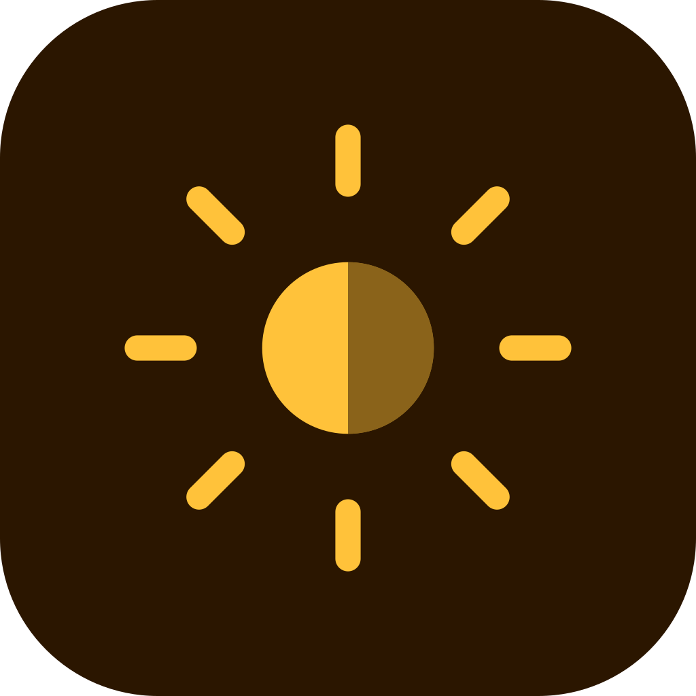
</p>

<h1 align="center">Sombra</h1>

<p align="center">
  An Android app that helps you stay safe in the sun.<br />
  Real-time UV index · personalised safe exposure time · sunscreen reminders · home screen widget
</p>

<p align="center">
  
  
  
  
  
  
  
</p>

<p align="center">
  <a href="#why">Why</a> ·
  <a href="#screenshots">Screenshots</a> ·
  <a href="#features">Features</a> ·
  <a href="#current-status">Status</a> ·
  <a href="#architecture">Architecture</a> ·
  <a href="#getting-started">Getting started</a> ·
  <a href="#roadmap">Roadmap</a>
</p>

---

## Why

Most people check the temperature before going out, but temperature isn't what burns you. **UV radiation is.** A cool, cloudy day can still have a UV index of 6 or 7, because clouds let most UV through.

Sombra puts the **UV index first**. It tells you how long you can stay outside before your skin starts to burn, based on your skin type, and reminds you when it's time to reapply sunscreen.

## Screenshots

<table align="center">
  <tr>
    <td align="center">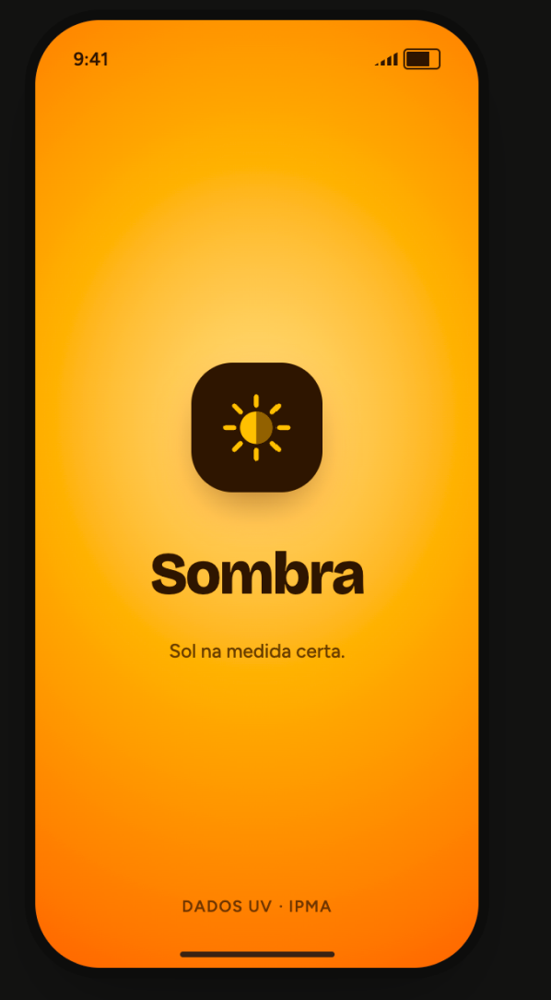</td>
    <td align="center">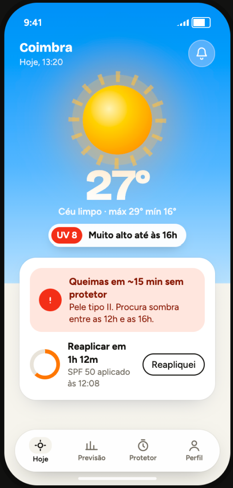</td>
    <td align="center">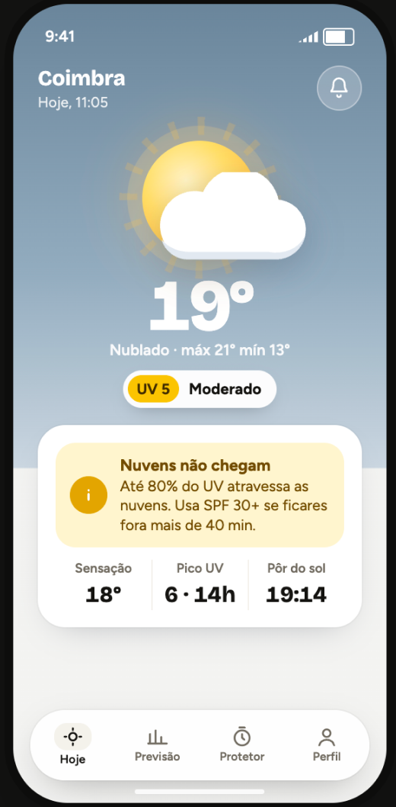</td>
  </tr>
  <tr>
    <td align="center"><b>Splash</b></td>
    <td align="center"><b>Home · sunny</b></td>
    <td align="center"><b>Home · cloudy</b></td>
  </tr>
  <tr>
    <td align="center">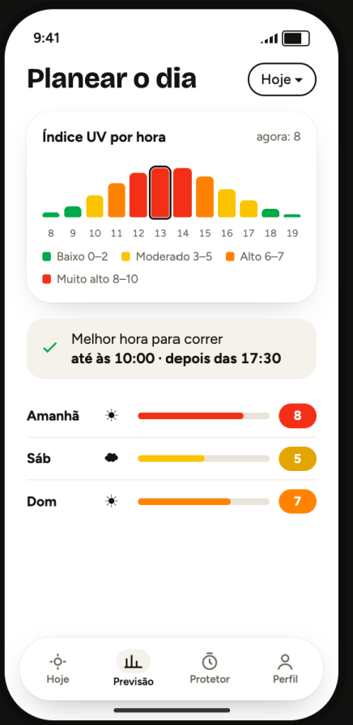</td>
    <td align="center">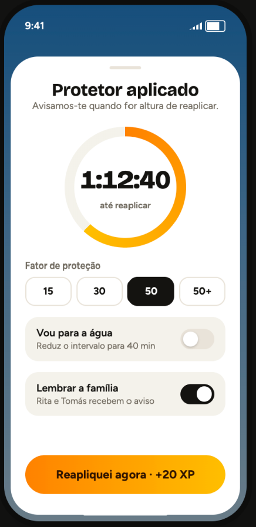</td>
    <td align="center">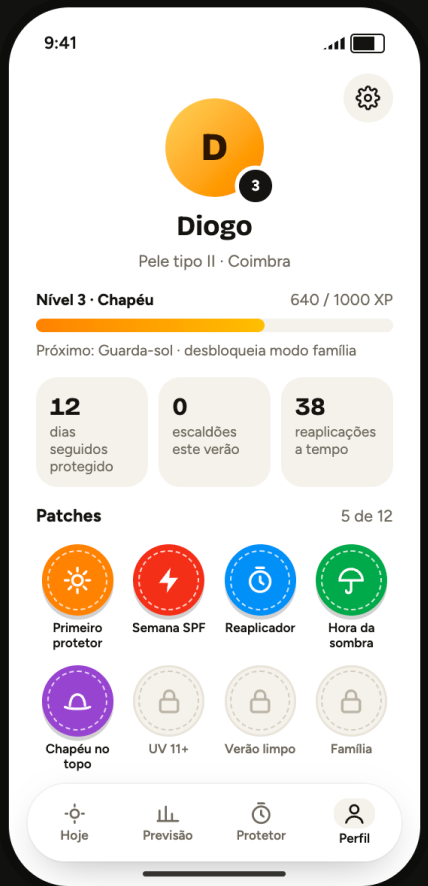</td>
  </tr>
  <tr>
    <td align="center"><b>UV forecast</b></td>
    <td align="center"><b>Sunscreen timer</b></td>
    <td align="center"><b>Profile</b></td>
  </tr>
</table>

> [!NOTE]
> These are design mockups. They will be replaced with real screenshots as each screen is implemented.

## Features

| | Feature | Description |
|:---:|---|---|
| ☀️ | **Real-time UV index** | For your current location, colour-coded with the WHO UV scale |
| ⏱️ | **Safe exposure time** | "You'll burn in ~20 min without sunscreen", based on your skin type (Fitzpatrick I–VI) and the current UV |
| 🧴 | **SPF recommendation** | Adapts to the UV level and your skin |
| 🔔 | **Sunscreen reminders** | Reapply every 2 hours, or every 40 minutes after swimming |
| ⚠️ | **Daily UV alerts** | "UV will be high today at 1 PM" |
| 📅 | **Forecast** | Hourly forecast with safe time windows (UV below 3) and a 5-day outlook |
| 📱 | **Home screen widget** | Current UV and time until the next reapplication |
| 📴 | **Works offline** | The last forecast is cached and shown with its update time |
| 🏅 | **Levels and patches** | Rewards protective habits (reapplying on time, avoiding peak hours), never time spent in the sun |
| 🌗 | **Themes and languages** | Light and dark theme, English and Portuguese |

## Current status

Every screen uses real data. Weather comes from Open-Meteo, accounts and profiles from Supabase, and the sunscreen timer and history are stored on the device and synced to the account.

| Screen | Package | Data |
|---|---|---|
| Splash | `app` · `main/` | Supabase session → Login, Skin type or Home |
| Login (forgot password) | `presentation/login` | Supabase Auth |
| Register (password strength, "use my location") | `presentation/register` | Supabase Auth + profile |
| Skin type onboarding | `presentation/skintype` | Profile (local + Supabase) |
| Home (skeleton, error and retry, offline banner, burn time, timer card) | `presentation/home` | Open-Meteo + timer + profile |
| UV forecast (day picker, hourly chart, best time, next days) | `presentation/forecast` | Open-Meteo |
| Sunscreen timer (SPF, water, reminder notification) | `presentation/timer` | Timer + Open-Meteo |
| Profile (level, XP, streak, patches, edit, sign out, delete account) | `presentation/profile` | Profile + sunscreen history |

### Navigation flow

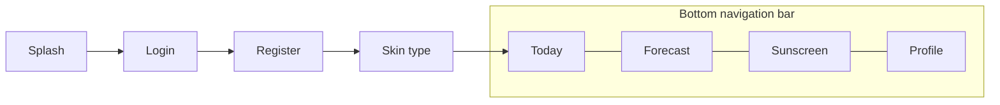
```mermaid
flowchart LR
    S[Splash] --> L[Login] --> R[Register] --> ST[Skin type] --> H

    subgraph tabs["Bottom navigation bar"]
        H[Today] --- F[Forecast] --- T[Sunscreen] --- P[Profile]
    end
```

The bottom bar (`SombraNavigationBar`) lives in `SombraNavHost` and only appears on the four top-level tabs defined in `TopLevelDestination`. Switching tabs pops back to the start destination and saves and restores each tab's state, so tabs never pile up on the back stack.

### Levels

Users level up by building protective habits.

<table align="center">
  <tr>
    <td align="center"></td>
    <td align="center"></td>
    <td align="center"></td>
    <td align="center"></td>
    <td align="center"></td>
  </tr>
  <tr>
    <td align="center">1 · Sombrinha</td>
    <td align="center">2 · Filtro</td>
    <td align="center">3 · Chapéu</td>
    <td align="center">4 · Guarda-sol</td>
    <td align="center">5 · Eclipse</td>
  </tr>
</table>

### Patches

<table align="center">
  <tr>
    <td align="center"></td>
    <td align="center"></td>
    <td align="center"></td>
    <td align="center"></td>
  </tr>
  <tr>
    <td align="center">Primeiro Protetor</td>
    <td align="center">Semana SPF</td>
    <td align="center">Reaplicador</td>
    <td align="center">Hora da Sombra</td>
  </tr>
  <tr>
    <td align="center"></td>
    <td align="center"></td>
    <td align="center"></td>
    <td align="center"></td>
  </tr>
  <tr>
    <td align="center">Chapéu no Topo</td>
    <td align="center">UV Extremo</td>
    <td align="center">Verão Limpo</td>
    <td align="center">Família</td>
  </tr>
</table>

## Tech stack

| Area | Technology | Status |
|---|---|:---:|
| Language | Kotlin 2.2, Coroutines, Flow | ✅ |
| UI | Jetpack Compose, Material 3 | ✅ |
| Navigation | Navigation Compose (type-safe routes) | ✅ |
| Splash | SplashScreen API with an animated exit | ✅ |
| Dependency injection | Hilt (KSP) | ✅ |
| Architecture | MVVM + Clean Architecture, multi-module, unidirectional data flow | ✅ |
| Networking | Ktor 3.1 (OkHttp engine, content negotiation, timeouts, logging in debug builds only) + kotlinx.serialization | ✅ |
| Weather data | [Open-Meteo Forecast API](https://open-meteo.com/) (no API key needed): client and DTO → domain mapper | ✅ |
| Time | `java.time` with an injected `Clock`, so time-based logic can be tested | ✅ |
| Authentication | [Supabase Auth](https://supabase.com/docs/guides/auth) over its REST API with Ktor (email + password), RLS, `delete-account` Edge Function | ✅ |
| Local storage | SharedPreferences + kotlinx.serialization today (profile, timer, history, forecast cache); Room planned | 🟡 |
| Preferences | DataStore (skin type, settings) | 🔜 |
| Location | Fused Location Provider (coarse location only) + Geocoder, with timeouts | ✅ |
| Background work | WorkManager | 🔜 |
| Widget | Jetpack Glance | 🔜 |
| Testing | JUnit 4, Ktor `MockEngine`, `kotlinx-coroutines-test`, Turbine, Robolectric, Compose UI tests (fakes instead of mocks) | ✅ |
| CI | GitHub Actions (build, lint, unit tests) | 🔜 |

✅ in place · 🟡 partly in place · 🔜 planned

## Architecture

The project is split into Gradle modules. Dependencies only point one way, so the business rules in `domain` never depend on the UI or on where the data comes from.

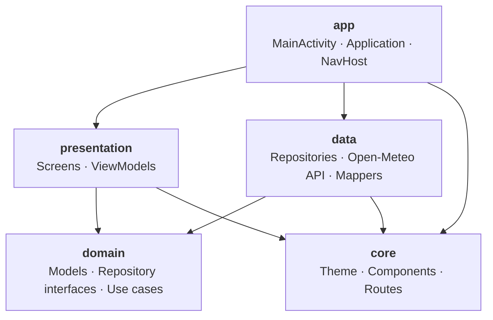
```mermaid
flowchart TD
    app["<b>app</b><br/>MainActivity · Application · NavHost"]
    presentation["<b>presentation</b><br/>Screens · ViewModels"]
    data["<b>data</b><br/>Repositories · Open-Meteo API · Mappers"]
    domain["<b>domain</b><br/>Models · Repository interfaces · Use cases"]
    core["<b>core</b><br/>Theme · Components · Routes"]

    app --> presentation
    app --> data
    app --> core
    presentation --> domain
    presentation --> core
    data --> domain
    data --> core
```

| Module | Responsibility |
|---|---|
| `app` | Entry point: `MainActivity`, `SombraApplication` (`@HiltAndroidApp`), splash screen and the `SombraNavHost` |
| `presentation` | One package per screen with `Screen`, `ViewModel`, `UiState`, its navigation entry and a `component/` folder |
| `domain` | Models, repository interfaces and use cases, split by feature (`weather`, `sunscreen`). Depends on no other module |
| `data` | Hilt modules, Ktor client, Open-Meteo API, DTO → domain mappers and repository implementations |
| `core` | Design system (`SombraTheme`, `SombraColors`, type, shapes), shared components and the navigation routes |

### Data flow

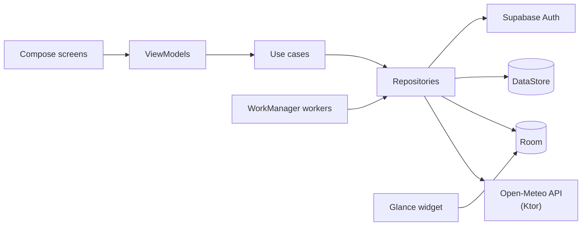
```mermaid
flowchart LR
    UI["Compose screens"] --> VM["ViewModels"]
    VM --> UC["Use cases"]
    UC --> R["Repositories"]
    R --> API["Open-Meteo API<br/>(Ktor)"]
    R --> DB[("Room")]
    R --> DS[("DataStore")]
    R --> SB["Supabase Auth"]
    W["WorkManager workers"] --> R
    G["Glance widget"] --> DB
```

The target design is **offline-first**: screens always read from Room. Repositories refresh the cache from the network in the background and expose the result as a `Flow`. The widget reads only from Room and never makes network calls.

## Project structure

```
Sombra/
├── Assets/                         # Logo, mockups, illustrations, nav icons (SVG, PNG, Android drawables)
├── README.md
└── Sombra/                         # Android Studio project
    ├── app/
    │   └── com/dmm/sombra/
    │       ├── MainActivity.kt         # Splash screen + setContent
    │       ├── SombraApplication.kt    # @HiltAndroidApp
    │       └── navigation/
    │           └── SombraNavHost.kt    # NavHost + shared bottom navigation bar
    ├── presentation/
    │   └── com/dmm/presentation/
    │       ├── main/                   # MainViewModel (session check behind the splash)
    │       ├── login/                  # Sky header, "or" divider
    │       ├── register/               # Password strength label
    │       ├── skintype/               # Skin type grid and cards, sun-place chips, onboarding footer
    │       ├── home/                   # Timer card, skeleton, offline banner, weather details
    │       │   ├── HomeScreen.kt       # HomeScreen (stateful) + HomeContent (stateless)
    │       │   ├── HomeViewModel.kt
    │       │   ├── HomeUiState.kt      # Loading · Error · Content
    │       │   ├── HomeNavigation.kt   # NavGraphBuilder.homeScreen()
    │       │   └── TimerCardMapper.kt  # TimerStatus → TimerCardUiState
    │       ├── forecast/               # Bar chart, legend, hourly UV card, UV day cards
    │       ├── timer/                  # Timer ring, SPF selector, water toggle, stats card, buttons
    │       └── profile/                # Avatar, header, stat cards, level progress, patches
    ├── domain/
    │   └── com/dmm/domain/
    │       ├── weather/model/          # Forecast, CurrentWeather, HourlyUv, DailyForecast, UvLevel, WeatherCondition
    │       └── sunscreen/
    │           ├── model/              # SunscreenSession, TimerStatus
    │           ├── repository/         # SunscreenRepository (interface)
    │           └── usecase/            # ObserveTimerStatusUseCase
    ├── data/
    │   └── com/dmm/data/
    │       ├── di/                     # DataModule (bindings, Clock), NetworkModule (HttpClient)
    │       ├── remote/                 # OpenMeteoApi + dto/ForecastResponseDto
    │       ├── mapper/                 # ForecastMapper (DTO → domain)
    │       └── repository/             # Open-Meteo, Supabase, local storage (SharedPreferences)
    ├── core/
    │   └── com/dmm/core/
    │       ├── designsystem/           # SombraTheme, SombraColors, Type, Shape
    │       ├── components/             # Buttons, text field, top bar, nav bar, skeleton, step progress
    │       └── navigation/             # SombraRoutes, TopLevelDestination
    └── gradle/
        └── libs.versions.toml          # All dependency versions
```

### Shared components (`core/components`)

| Component | Used for |
|---|---|
| `SombraSunButton`, `SombraDarkButton`, `SombraSecondaryButton` | Primary, dark and outlined actions |
| `SombraTextField` | Email and password inputs |
| `SombraTopBar`, `SombraNavigationBar` | App bars |
| `SombraStepProgressBar` | Onboarding progress |
| `SombraSkeleton` | Loading placeholders |
| `SombraLinkPrompt`, `SombraButtonLabel` | "Don't have an account? Sign up" style links, button text |

### Adding a new screen

1. Add a route in `core/navigation/SombraRoutes.kt`:

   ```kotlin
   @Serializable
   data object SkinTypeRoute
   ```

2. Create a package in `presentation/` with `SkinTypeScreen.kt`, `SkinTypeViewModel.kt`, `SkinTypeUiState.kt` and `SkinTypeNavigation.kt`, using `home/` as a template. Put screen-only composables in a `component/` subfolder.
3. Register it in `SombraNavHost.kt` with `skinTypeScreen(...)`, and open it with `navController.navigate(SkinTypeRoute)`.
4. If it should be a bottom-bar tab, add it to `TopLevelDestination` with an icon and a label.

## Getting started

### Requirements

- Android Studio (latest stable)
- JDK 17
- An Android device or emulator running **Android 8.0 (API 26)** or later
- A free [Supabase](https://supabase.com/) project (for sign-in; the rest of the project builds without it)

### 1. Clone the repository

```bash
git clone https://github.com/DMarques24/Sombra.git
cd Sombra/Sombra
```

### 2. Set up Supabase

1. Create a project at [supabase.com](https://supabase.com/).
2. Run the SQL files in [`Sombra/supabase/migrations`](Sombra/supabase/migrations) in order (SQL Editor, or `supabase db push`). They create the `profiles` and `sunscreen_events` tables with Row Level Security, so each user can only read and write their own rows.
3. Deploy the [`delete-account`](Sombra/supabase/functions/delete-account) Edge Function (`supabase functions deploy delete-account`). It is the only code that uses the service role key, and it runs on the server.
4. Under **Project Settings → API Keys**, copy the **Project URL** and the **publishable** key (`sb_publishable_…`). **Never** put the `service_role` / secret key in the app.
5. Add them to `local.properties` in the `Sombra/` folder. This file is git-ignored, so the keys are never committed:

   ```properties
   supabase.url=https://your-project-id.supabase.co
   supabase.anonKey=sb_publishable_...
   ```

   They reach the app through `BuildConfig` in the `:data` module. Without them the project still builds and runs; sign-in just shows "not configured".

### Release signing (optional)

Create an upload key and a git-ignored `keystore.properties` in the `Sombra/` folder:

```properties
storeFile=release-keys/sombra-upload.jks
storePassword=...
keyAlias=sombra-upload
keyPassword=...
```

`./gradlew bundleRelease` then builds a signed, R8-minified App Bundle. Without the file, the release build is simply unsigned. Keep a backup of the `.jks` and the passwords outside the repository.

### 3. Run

Open the `Sombra/` folder in Android Studio, wait for Gradle to sync, and run the `app` configuration.

From the command line:

```bash
./gradlew installDebug        # build and install on a connected device
./gradlew testDebugUnitTest   # unit tests
./gradlew :data:testDebugUnitTest  # only the data layer tests (API + mapper)
./gradlew lint                # static analysis
```

Open-Meteo doesn't need an API key, so weather data works straight away.

### Tests

All tests run on the JVM (`./gradlew test`): Compose UI tests use Robolectric, so no device is needed.

| Layer | Tests | What they check |
|---|---|---|
| Domain | `CalculateSunRiskUseCaseTest`, `UvLevelTest`, `CalculateProgressTest`, `GetTodayWeatherUseCaseTest` | Burn time for every skin type, WHO UV boundaries (2.4 → Low, 2.5 → Moderate), XP, streaks and patches, "today" in the forecast's time zone |
| Data | `OpenMeteoApiTest`, `ForecastMapperTest`, `OpenMeteoWeatherRepositoryTest`, `SupabaseErrorsTest`, `NetworkModuleTest` | Ktor `MockEngine`: success, no network (with and without cache), 500 and invalid JSON; Supabase error mapping; **no request logging in release** |
| ViewModel | `HomeViewModelTest`, `TimerViewModelTest` | Loading → Content / Error, retry, offline cache, refresh, and every timer transition with a controllable `Clock` (Turbine + `MainDispatcherRule`, fakes instead of mocks) |
| UI | `HomeScreenTest`, `TimerScreenTest` | Compose (`createComposeRule`): what each state shows and that buttons call the right callbacks |

`OpenMeteoApiLiveTest` calls the real API, so it is `@Ignore`d and meant to be run by hand.

## How it works

### UV data

The app calls the Open-Meteo forecast endpoint with the device's coarse location:

```http
GET https://api.open-meteo.com/v1/forecast
    ?latitude=40.20&longitude=-8.41
    &current=temperature_2m,apparent_temperature,is_day,weather_code,uv_index
    &hourly=uv_index
    &daily=weather_code,temperature_2m_max,temperature_2m_min,uv_index_max,sunset
    &timezone=auto
    &forecast_days=5
```

`ForecastMapper` turns the response into a domain `Forecast` (current weather, hourly UV, 5 daily entries and the fetch time). If the `current` block has no `uv_index`, it uses the UV value for the current hour from the hourly list instead.

`WeatherCondition.fromWmoCode()` turns the `weather_code` into `Clear`, `PartlyCloudy`, `Cloudy`, `Fog`, `Rain`, `Snow` or `Storm`. Unknown codes fall back to `Cloudy`. The condition picks the illustration shown on the Home screen:

<table align="center">
  <tr>
    <td align="center"></td>
    <td align="center"></td>
    <td align="center"></td>
    <td align="center">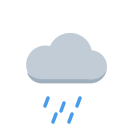</td>
    <td align="center"></td>
  </tr>
  <tr>
    <td align="center">Clear<br /><code>0, 1</code></td>
    <td align="center">Partly cloudy<br /><code>2</code></td>
    <td align="center">Cloudy · Fog<br /><code>3 · 45, 48</code></td>
    <td align="center">Rain · Storm<br /><code>51–67, 80–82 · 95–99</code></td>
    <td align="center">Night<br /><code>is_day = 0</code></td>
  </tr>
</table>

### UV scale (WHO)

`UvLevel.from(uvIndex)` rounds the value and maps it onto the scale:

| UV index | Level | Colour |
|:---:|---|---|
| 0–2 | Low | 🟢 Green |
| 3–5 | Moderate | 🟡 Yellow |
| 6–7 | High | 🟠 Orange |
| 8–10 | Very high | 🔴 Red |
| 11+ | Extreme | 🟣 Violet |

### Safe exposure time

Each Fitzpatrick skin type has a minimal erythemal dose (MED), the amount of UV energy that causes visible reddening. One UV index unit is 0.025 W/m² of erythemal irradiance, so:

```
minutes to burn ≈ MED (J/m²) / (UV index × 0.025 × 60)
```

MED values used: I = 200, II = 250, III = 300, IV = 450, V = 600, VI = 1000 J/m². For example, skin type II at UV 8 gives about 21 minutes. Below UV 1 there is no burn risk, and from 120 minutes the app shows "120+".

> [!IMPORTANT]
> The result is **not** multiplied by the SPF value. In real life people apply much less sunscreen than the amount used in lab tests, so the app caps the estimate and always shows it as a guideline.

### Sunscreen timer

The timer is already working in the domain layer:

- A `SunscreenSession` stores when sunscreen was applied, the SPF and whether you're in the water. It lasts **2 hours**, or **40 minutes** in the water.
- `ObserveTimerStatusUseCase` combines the active session with a once-per-second tick and emits a `TimerStatus`:
  - `Idle`: no session
  - `Running(remaining, progress)`: before `endsAt`
  - `Finished(overdue)`: past `endsAt`, for up to 30 minutes, then it goes back to `Idle` on its own
- `TimerCardMapper` turns that status into what the Home timer card shows.
- Sessions are stored on the device by `PreferencesSunscreenRepository`, a `@Singleton` shared by Home and the timer screen, so both always show the same state. A reminder notification is scheduled with `AlarmManager` (and rescheduled after a reboot).

Because the current time comes from an injected `java.time.Clock`, tests can use a fixed clock.

### Background work (planned)

| Worker | Type | What it does |
|---|---|---|
| `ForecastSyncWorker` | Periodic (every 3 h) | Refreshes the cache, updates the widget, schedules today's UV alert |
| `UvAlertWorker` | One-time | Notifies before the UV index reaches 6 or more |
| `ReapplyReminderWorker` | One-time (2 h or 40 min delay) | Reminds you to reapply sunscreen |

WorkManager doesn't fire at the exact minute. A few minutes of delay is fine for a sunscreen reminder, and it avoids the exact-alarm permission that Android 14 restricts.

## Permissions

| Permission | Why |
|---|---|
| `INTERNET` | Forecast data and sign-in. |
| `ACCESS_COARSE_LOCATION` | UV index for your area. City-level precision is enough, so precise location is never requested. If you deny it, the city from your profile is used. |
| `POST_NOTIFICATIONS` | "Time to reapply" reminder. Requested when you start a timer (Android 13+). |
| `RECEIVE_BOOT_COMPLETED` | Reschedules a running reminder after the phone restarts. |

## Privacy

- Your **account** (email and password) is managed by Supabase Auth. The password is never stored on the device.
- Your **profile** (name, city, skin type, sun places) and **sunscreen history** (XP, levels, patches) are stored on the device and synced to your Supabase account, protected by Row Level Security: only you can read them.
- Your **location** is used to request the forecast. The forecast cache keeps it rounded to about 11 km; it is never sent to Supabase.
- The session tokens are kept in private app storage and excluded from Android backups.
- **Delete account** (Profile → settings) permanently deletes the account and all its data on the server.

## Roadmap

- [x] Multi-module project setup (`app`, `presentation`, `domain`, `data`, `core`)
- [x] Design system: colours, light and dark theme
- [x] Splash screen with animated logo
- [x] Hilt dependency injection
- [x] Type-safe navigation with a bottom navigation bar (4 tabs)
- [x] Shared component library in `core`
- [x] Login, register and skin type onboarding UI
- [x] Home screen UI with loading, error and offline states
- [x] Forecast screen UI (hourly chart, 5-day cards)
- [x] Sunscreen timer UI and timer logic (`ObserveTimerStatusUseCase`)
- [x] Profile screen UI with levels and patches
- [x] Open-Meteo client, DTOs and domain mapper, with unit tests
- [ ] Weather repository and connecting forecast data to Home and Forecast
- [ ] CI with GitHub Actions
- [ ] Room cache and offline mode
- [ ] Location with permission handling
- [ ] Supabase login and register
- [ ] Save the skin type (DataStore) and calculate safe exposure time
- [ ] UV alerts and sunscreen reminders (WorkManager)
- [ ] Glance widget
- [ ] Levels and patches logic
- [ ] Accessibility, EN/PT translations
- [ ] Release build on GitHub Releases

## Disclaimer

> [!WARNING]
> Sombra gives general guidance based on public weather data. It is not medical advice. If you have concerns about your skin, talk to a dermatologist.

## Author

**Diogo Marques** · [github.com/DMarques24](https://github.com/DMarques24)

## License

Copyright © 2026 Diogo Marques. All rights reserved.

The source code is public so it can be viewed and reviewed. You may not copy, modify or distribute it without permission.
